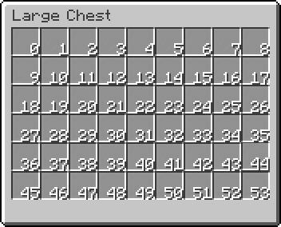
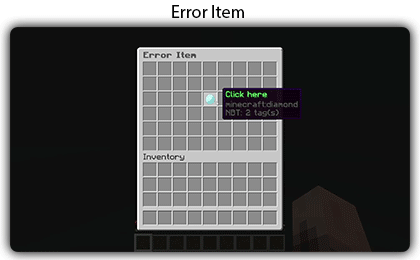
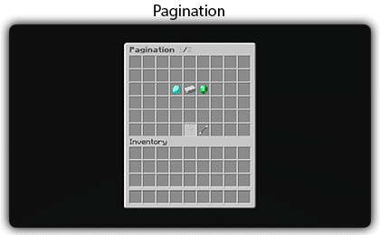

# Buttons

## Informations

Buttons allow you to customize the actions of your inventory. You have to specify the type of the button each time and configure the elements specific to the type of button. Here you find the buttons that are integrated by default in the plugin, other plugins can also add new types of buttons.

For each button you will have to specify an ItemStack, to know how to configure an itemstack go [here](https://zmenu.groupez.dev/configurations/items).

## Default

Here are the configuration elements that are common to all types of buttons. You can use these elements everywhere.

```yaml
example: 
  # Select the button type, NONE by default
  type: <button type>
  # Set the slot of the button, 0 by default
  slot: <slot>
  # Put slots for the button, empty by default
  slots: <list of slot>
  # Set the button page, 1 by default
  page: <page>
  # Define whether the button should appear on all pages
  isPermanent: <true of false>
  # Item that will be displayed, please look at the Items documentation
  item: <itemstack>
  # Played a sound when clicking
  sound: <sound from XSound>
  # Sound volume
  volume: <volume of sound>
  # Sound pitch
  pitch: <pitch of sound>
  # Messages sent during clicks
  messages: <list of messages>
  # Displays a link in the message list
  openLink: 
    link: <link>
    message: <message>
    replace: <replace placeholder>
    hover: <list of messages>
  # Close inventory on click
  closeInventory: <true or false>
  # Refresh item name and lore on click
  refreshOnClick: <true or false>  
  # Display player head, need a placeholder or a player name
  playerHead: <placeholder>
  # You can set one or more permissions to display the item
  permission: <permission>  
  # Show another button if not checked (placeholder check, permissions or other)
  else: <else button>
  # Placeholder
  placeholder: <placeholder>
  # Placeholder value
  value: <value for placeholder>
  # Placeholder Action
  action: <action for placeholder>
  # List of placeholders
  placeholders: <list of placeholder>
  # Update button on click (update everything)
  update: <boolean>
  # Command send by the players
  commands: <list of text>
  # Command send by the console on click
  consoleCommands: <list of text>
  # Command send by the console on right click
  consoleRightCommands: <list of text>
  # Command send by the console on left click
  consoleLeftCommands: <list of text>
  consolePermissionCommands: <list of text>
  consolePermission: <permissions>
  # Update item name and lore when the player click on the inventory
  updateOnClick: <boolean>
  # Sets the requirements the player should have to see the button. 
  view_requirement: <requirement>
  # Sets the requirements the player should have to click on the button. 
  click_requirement: <requirement>
```

### TYPE

```yaml
type: <button type>
```

The type of the button, by default the type will be NONE.

***

### SLOT

```yaml
slot: <number between 0 and inventory limit>
```

```yaml
slot: <page>-<slot>
```

Position the slot on which your item will be displayed.&#x20;


* Slots start at **0**.
* You can specify the page number directly in the slot. You should do it like this: `<page>-<slot>`. So for example for a button on page **2** and slot **8** we have: **2-8**.
* To have multiple items on the same slot you must use the **else** button.


<figure><figcaption><p>Double chest slots</p></figcaption></figure>

To display a button on several slots you can do like this:

```yaml
slots:
  - 0
  - 1
  - 2
  - 3
  - 4
  ...
```

You can also create slot ranges this way: `<startslot>-<end slot>`

```yaml
slots:
  - 0-9 # From slot 0 to slot 9
  - 18
  - 17
  - 26
  - 27
  - 35
  - 36
  - 44-53 # From slot 44 to 53
```

***

### Page

```yaml
page: <page numer>
```

Allows you to specify the page where the button will be displayed. By default the page will be number **1**.

***

### IsPermanent

```yaml
isPermanent: <true of false>
```

Allows you to specify if the button should be displayed on all pages of the inventory. If your inventory has only one page then you don’t need to use it.

***

### useCache

```yaml
useCache: <true of false>
```

Allows to enable or not the cache on the item, by default it will always be used if the button item does not contain a placeholder.

***

### Item

```yaml
item: <itemstack>
```

Allows you to specify the item that will be displayed, more information [here](https://zmenu.groupez.dev/configurations/items).

***

### Sound

```yaml
sound: ENTITY_COW_HURT
pitch: 1.5
volume: 0.5
```

Allows to send a sound to the player when clicking. You must use the sounds present in [XSound](https://github.com/CryptoMorin/XSeries/blob/master/src/main/java/com/cryptomorin/xseries/XSound.java). You can then adjust the **pitch** and **volume** of the sound.

***

### Messages

```yaml
messages:
  - <line 1>
  - <line 2>
  ...
```

Allows you to send a list of messages to the player when clicking.

***

### Openlink

```yaml
link: <link>
message: <message>
replace: <replace string>
hover:
  - <line 1>
  - <line 2>
  ...
```

Allows you to send a clickable message to the player. You have to put in your message list a text that will be replaced by the clickable link. You have an example below.&#x20;

**ToDo:** Make sure you can choose the type of action between SHOW\_LINK, SUGGEST\_COMMAND and PERFORM\_COMMAND

> Example:

```yaml
messages:
  - "&8(&6zMenu&8) &fAdd your server to the site &3Serveur Minecraft Vote"
  - "&8(&6zMenu&8) %link% &d!"
openLink:
  link: "https://serveur-minecraft-vote.fr/utiliser/un/code/cadeau?code=ZMENU"
  message: "&b&lClick here"
  replace: "%link%"
  hover:
    - "&bClick here !"
```

***

### CloseInventory

```yaml
closeInventory: <true of false>
```

Allows you to close the inventory after clicking.

***

### RefreshOnClick

```yaml
refreshOnClick: <true or false>
```

Allows to refresh the button after a click. For example you can use this to make a shop, an example is provided in the default configuration.

***

### PlayerHead

```yaml
playerHead: <placeholder>
```

Allows to display a player's head according to a placeholder. You can put the placeholder `%player%` to get the player who opens the inventory.\
A cache system allows a direct display of the skin for the heads.

***

### Permission

```yaml
permission: <permission>
```

Allows to define a permission that the player must have to display the item. You can reverse the permission by adding **`!`** in front of the permission. Thereby the plugin will check that the player does not have the permission.\
You can also define a list of permissions the player must have:

```yaml
permission:
  - "first.permission"
  - "!second.permission"
```

***

### Or Permission

Allows you to define a permission list, but the player should only have one of his permissions.

```yaml
orPermission:
  - "first.permission"
  - "!second.permission"
```

***

### Else

```yaml
else: <else button>
```

Allows to display an else button if the player doesn't have permission. You can put several else button in a row without problem. You have an example of use in the default configuration.

Example:

```yaml
items:
  |mybutton:
  |  <item configuration>
  |--|else:
  |  |  <first else configuration>
  |  |--|else:
  |  |--|  <second else configuration>
```

***

### Placeholder

```yaml
  placeHolder: <placeholder>
  value: <value for placeholder>
  action: <action for placeholder>
```

Allows you to define a permission using a placeholder. You must specify the placeholder, the action to be performed with the value, and the value that will be checked.

**Action:**

* `BOOLEAN` (aliase: `b=`): Check if a value is true or false
* `EQUALS_STRING` (aliase: `s=`): Allows to check if the text is strictly equal to the text
* `EQUALSIGNORECASE_STRING` (aliase: `s==`): Allows to check if the text is equal by ignoring the case to the text
* `CONTAINS_STRING` (aliase: `sc`): Allows to check if the text is contained in the value
* `SUPERIOR` (aliase: `>`): Used to check if a number is strictly superior than the value
* `LOWER` (aliase: `<`): Used to check if a number is strictly lower than the value
* `SUPERIOR_OR_EQUAL` (aliase: `>=`): Allows you to check if a number is superior than or equal to the value
* `LOWER_OR_EQUAL` (aliase: `<=`): Allows you to check if a number is lower than or equal to the value
* `EQUAL_TO` (aliase: `==`): Allows to verify that two numbers are identical

You can check multiple placeholders like this:

```yml
placeholders:
  - placeholder: <your placeholder>
    value: <your value>
    action: <your action>
  - placeholder: <your placeholder>
    value: <your value>
    action: <your action>
```

***

### Update

```yaml
update: <true or false>
```

Allows to set the name and the lore of the item automatically. To set the interval you must do it from [here](../inventories.md#update-interval).

***

### updateOnClick

```yaml
updateOnClick: <true of false>
```

Allows you to update the button when a player clicks on any other button in the inventory

***

### Commands

```yaml
commands: <list of text>
```

Allows the player to execute a list of commands.

***

### Console Commands

```yaml
consoleCommands: <list of text>
consoleRightCommands: <list of text>
consoleLeftCommands: <list of text>
consolePermissionCommands: <list of text>
consolePermission: <permissions>
```

You can execute commands from the console based on the player's click. Also commands if the player has the permissions.

***

### View Requirement

Sets the requirements the player should have to see the button. More information [here](requirements.md#view-requirement).

***

### Click Requirement

Sets the requirements the player should have to click on the button. More information [here](requirements.md#click-requirement).

***

### Actions

You can define a list of actions to perform when clicking. More information [here](actions.md).

```yaml
actions:
  - type: message
    messages:
      - "example"
```

***

### Error item ([zMenu+](https://minecraft-inventory-builder.com/resources/zmenu.4))

Example of inventory with Fail Item. In this example, if the player is not creative a barrier with the name error will be displayed for 10 ticks

```yaml
name: "&8Test"
size: 54
items:
  example:
    item:
      material: DIAMOND
    slot: 22
    error_item:
      duration: 10 # Duration of item display
      item: # Item to display
        material: BARRIER
        name: "&cError"
    click_requirement:
      left_click:
        clicks:
          - ALL
        requirements:
          - type: placeholder
            placeholder: "%player_gamemode%"
            value: "CREATIVE"
            action: equals_string
```

<figure><figcaption></figcaption></figure>

***

## NONE

The `NONE` type is the default type, it allows to display a button. You don't have to specify it, it will be automatically chosen if the plugin doesn't find a type.

## INVENTORY

The `INVENTORY` type allows the player to open a new inventory.

```yaml
inventory: <inventory file name>
plugin: <plugin name>
toPage: <page>
arguments:
  - <argument 1>
  - <argument 2>
```

`inventory` is the name of the inventory you want to open. The name of the inventory will be the name of the inventory file.

`plugin` is the name of the plugin from where the inventory comes from. It is advisable to specify the plugin name to avoid opening another inventory with the same name.

`toPage` is the number of the page you want to open. Default will be 1.

`arguments` is the list of arguments you can add. An argument can contain a name in the following format: `<name>:<value>`

You must specify the name of the inventory. The name of the inventory will be the name of the file where the inventory is located. We also advise you to specify the name of the plugin where the inventory comes from to avoid confusion if two inventories have the same name.

## BACK

The `BACK` type allows you to return to the previous inventory.

## HOME

The `HOME` type allows you to return to the main inventory, the one that was opened first.

## NEXT

The `NEXT` type allows you to go to the next page if it exists. You can use the `else` element to display another button if there is no next page.

Example:

```yaml
next:
  type: NEXT
  isPermanent: true
  slot: 50
  item:
    material: ARROW
    name: "&fNext"
  else: #Displays another button if there is no next page.
    item:
      material: BLACK_STAINED_GLASS_PANE
```

## PREVIOUS

The `PREVIOUS` type allows you to go to the previous page if it exists. You can use the `else` element to display another button if there is no previous page.

```yaml
previous:
  type: PREVIOUS
  isPermanent: true
  slot: 48
  item:
    material: ARROW
    name: "&fPrevious"
  else: #Displays another button if there is no next page.
    item:
      material: BLACK_STAINED_GLASS_PANE
```

## MAINMENU

The `MAINMENU` allows you to returns to the main inventory you chose in the config.json

## JUMP

The `JUMP` type allows to change page, to a predefined page.

```yaml
jumpButton:
  type: JUMP
  toPage: 5
```

## PAGINATION ([zMenu+](https://minecraft-inventory-builder.com/resources/zmenu.4))

Example of inventory with the Pagination button. In this example the items will be displayed on slot 21, 22 and 23 and on several pages.\
The list of items contains the material and the name. You can put anything you want in the list. To use the value you must use the placeholder key. In this example the keys will be `%material%` and `%name%`.\
You can also apply changes to the value like this:

* `%lower_<key>%` - Displays the value in lower case.
* `%upper_<key>%` - Displays the value in upper case.
* `%capitalize_<key>%` - Display the value in capital You can use placeholders everywhere. For your requirements, commands, placeholders etc.

```yaml
name: "&8&lPagination &r&7%page%&8/&7%maxPage%"
size: 54
items:
  example:
    type: PAGINATION
    elements:
      - material: DIAMOND
        name: "diaMond"
      - material: IRON_INGOT
        name: "iron_INGOT"
      - material: EMERALD
        name: "emeRald"
      - material: COAL
        name: "cOAl"
      - material: GOLD_INGOT
        name: "gold_INGOT"
    slots:
      - 21-23
    item:
      material: "%material%"
      name: "&e%index% &7- &b%current%"
      lore:
        - "&8&m-----------------------"
        - ""
        - "&f%name% &8- &7Normal"
        - "&f%upper_name% &8- &fUpper case"
        - "&f%lower_name% &8- &7lower case"
        - "&f%capitalize_name% &8- &7Capitalized"
        - ""
        - "&8&m-----------------------"
  next:
    type: NEXT
    isPermanent: true
    slot: 50
    item:
      material: ARROW
      name: "&fNext"
  previous:
    type: PREVIOUS
    isPermanent: true
    slot: 48
    item:
      material: ARROW
      name: "&fPrevious"
```

<figure><figcaption></figcaption></figure>
