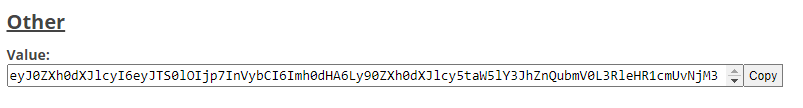

# Items

Before you start configuring the plugin itemstack make sure you are using the correct material for your version of the game.

Each button must be accompanied by an itemstack (except in certain specific cases).

```yaml
item:
  material: <material>
  amount: <amount>
  data: <data, only avaible between 1.8 and 1.12>
  durability: <durability>
  url: <player skin in base64>
  name: <display name>
  lore: <list of text>
  potion: <potion effect type>
  level: <potion level>
  sphash: <potion splash true or false>
  extended: <potion extended true of flase>
  glow: <add glow effect>
  modelID: <custom model id>
  enchants: <list of enchantments>
  flags: <list of itemflag>
  firework: <firework meta>
  banner: <banner color>
  patterns: <banner pattern>
  color: <leather armor color>
```

## Material

```yaml
material: <material>
```

The material of the item. You can use a placeholder to display a material.

> **Supported material values:**
>
> * [Material](https://hub.spigotmc.org/javadocs/bukkit/org/bukkit/Material.html) - Example: `material: STONE`
> * [Placeholder](https://www.spigotmc.org/resources/placeholderapi.6245/) value - Example: `material: %your_placeholder_material%`
> * [HeadDatabase](https://www.spigotmc.org/resources/head-database.14280/) (hdb:\<ID>) Example: `material: hdb:<ID>`
> * [Oraxen](https://www.spigotmc.org/resources/%E2%98%84%EF%B8%8F-oraxen-add-items-blocks-armors-hats-food-furnitures-plants-and-gui-1-18-1-20-1.72448/) (oraxen:\<item name>) Example: `material: oraxen:<item name>`
> * [ItemAdder](https://www.spigotmc.org/resources/%E2%9C%A8itemsadder%E2%AD%90emotes-mobs-items-armors-hud-gui-emojis-blocks-wings-hats-liquids.73355/) (itemsadder:\<item name>) Example: `material:` itemsadder`:<item name>`
> * [SlimeFun](https://github.com/Slimefun/Slimefun4) (slimefun:\<item name>) Example: `material:` slimefun`:<item name>`
> * [Nova](https://github.com/xenondevs/Nova) (nova:\<item/block name>) Example: `material: nova:<item/block name>`

***

## Amount

```yaml
amount: <amount>
```

The amount of the itemstack. You can use a placeholder to have a dynamic amount.

***

## Data

```yaml
data: <data, only avaible between 1.8 and 1.12>
```

The material data, only available for versions between **1.8** and **1.12**. By default its 0

***

## Durability

```yaml
durability: <durability>
```

The durability of the item, by default it is 0.

***

## Url

```yaml
url: <player skin in base64>
```

Allows to display a head with a url in base64. You can find the values of the heads on the site [minecraft-head.com](https://minecraft-heads.com/).

You must take the content in "Value" of the category "Other":



Example

```yaml
url: "eyJ0ZXh0dXJlcyI6eyJTS0lOIjp7InVybCI6Imh0dHA6Ly90ZXh0dXJlcy5taW5lY3JhZnQubmV0L3RleHR1cmUvNjM3YjhhMzk4MzdiYzNkNThmMDljOGM2ZTUzOTYyZDMzZjlmYTBiNjUzOThhNzc5MzUzYWRlMWUxNDcxM2VmZiJ9fX0="
```

***

## Name

```yaml
name: <display name>
```

The name that will be displayed on the item. Works with PlaceholderAPI.


If your server has Kyori Adventure, you can use the [mini message format](https://docs.adventure.kyori.net/minimessage/format.html).


***

## Lore

```yaml
lore:
  - <line1>
  - <line2>
  - <line3>
  - ...
```

Allows to display the lore of the item. Works with PlaceholderAPI.

***

## Potion

```yaml
  potion: <potion effect type>
  level: <potion level, 1 or 2> # 1 by default
  splash: <potion splash true or false>
  extended: <potion extended true of flase>
```

Allows you to create a potion. Check potion effect type [here](https://hub.spigotmc.org/javadocs/bukkit/org/bukkit/potion/PotionType.html).


Warning, a potion cannot be extended and with a level 2



```yml
# For potions in 1.8 up to 1.12 you have to do like this:
material: POTION
durability: 16454
```


***

## Glow

```yaml
glow: <true of false>
```

Allows the item to shine. Add random enchant and HIDE\_ENCHANT itemflag.

***

## ModelID

```yaml
modelID: <custom model id>
```

Allows you to put a custom model id on the item

***

## Enchantments

```yaml
enchants:
  - <enchantment name>,<enchantment level>
```

Allows you to add enchantments, you have to put the name of the enchantment then the level of the enchantment, like this: `ENCHANT,ENCHANT_LEVEL` List of enchantments available: [https://hub.spigotmc.org/javadocs/spigot/org/bukkit/enchantments/Enchantment.html](https://hub.spigotmc.org/javadocs/spigot/org/bukkit/enchantments/Enchantment.html)

***

## Flags

```yaml
flags:
  - <flag 1>
  - <flag 2>
  - ...
```

List of flags: [https://hub.spigotmc.org/javadocs/spigot/org/bukkit/inventory/ItemFlag.html](https://hub.spigotmc.org/javadocs/spigot/org/bukkit/inventory/ItemFlag.html)

***

## Color

```yaml
type: LEATHER_CHESTPLATE
color: 40,150,40 # RGB color

# Example with ARGB
color: 1,40,150,40 # ARGB color, Alpha, RED, GREEN, BLUE
```

Set the RGB color (Red, Green, Blue) for leather armorers. The format is as follows:

<pre class="language-yaml"><code class="lang-yaml"><strong>color: &#x3C;red>,&#x3C;green>,&#x3C;blue>
</strong></code></pre>

You can also add an alpha in the color to have ARGB

<pre class="language-yaml"><code class="lang-yaml"><strong>color: &#x3C;alpha>,&#x3C;red>,&#x3C;green>,blue>
</strong></code></pre>


The color format is the same for fireworks, banner and potion. \
Javadocs for Color [here](https://hub.spigotmc.org/javadocs/bukkit/org/bukkit/Color.html#fromARGB\(int,int,int,int\)).


***

## Firework

```yaml
type: FIREWORK
firework:
  star: true
  flicker: true
  trail: true
  type: BALL_LARGE
  colors:
    - 250,10,10 # RGB and ARGB
  fadeColors:
    - 250,10,250 # RGB and ARGB
```

Firework type: [https://hub.spigotmc.org/javadocs/spigot/org/bukkit/FireworkEffect.Type.html](https://hub.spigotmc.org/javadocs/spigot/org/bukkit/FireworkEffect.Type.html)

***

## Banner

```yaml
type: BANNER
banner: PINK # Banner color
patterns: # Banner pattern: <color>:<pattern>
  - RED:SQUARE_BOTTOM_LEFT
  - GREEN:STRIPE_LEFT
```

Allows you to create a banner. Pattern list: [https://hub.spigotmc.org/javadocs/spigot/org/bukkit/block/banner/PatternType.html](https://hub.spigotmc.org/javadocs/spigot/org/bukkit/block/banner/PatternType.html)

